# 🔐 JWT & RBAC REST API — Automated Testing Suite

> **Professional API test automation framework** for a Node.js REST API with JWT Authentication and Role-Based Access Control, powered by Playwright Test and backed by direct MongoDB verification.

`Playwright Test` · `TypeScript` · `MongoDB` · `Docker Compose` · `Node.js 18+` · `GitHub Actions`

---

## 📑 Table of Contents

- [Project Overview](#-project-overview)
- [Prerequisites](#-prerequisites)
- [Quick Start](#-quick-start)
- [Project Structure](#-project-structure)
- [Docker Environment Setup (Task 1)](#-docker-environment-setup-task-1)
- [Idempotent DB Seeding (Task 2)](#-idempotent-db-seeding-task-2)
- [Playwright API Testing Architecture](#-playwright-api-testing-architecture)
- [Custom Database Fixture (Dependency Injection)](#-custom-database-fixture-dependency-injection)
- [Security Coverage & Sanitization (DevSecOps)](#-security-coverage--sanitization-devsecops)
- [Deterministic Testing Guarantees](#-deterministic-testing-guarantees)
- [Continuous Integration (CI/CD Workflow)](#-continuous-integration-cicd-workflow)
- [Test Execution & Commands](#-test-execution--commands)
- [Visual Test Reports & Screenshots](#-visual-test-reports--screenshots)
- [Tool Selection & Justification](#-tool-selection--justification)
- [QA Deliverables & Documentation](#-qa-deliverables--documentation)

---

## 🎯 Project Overview

This project is a **comprehensive automated testing suite** designed to validate a JWT-authenticated REST API with Role-Based Access Control (RBAC). The System Under Test (SUT) is a Node.js/Express application that provides:

- **User authentication** — Signup, Signin, and JWT Refresh Token flows
- **Role-based authorization** — Three tiers: User, Moderator, and Admin
- **Tutorial CRUD** — Create, Read, Update, and Delete operations on a Tutorial resource

The test suite goes beyond simple HTTP response validation by incorporating **direct MongoDB database verification** — confirming that API operations actually persist the correct state at the data layer.

### Architecture Overview

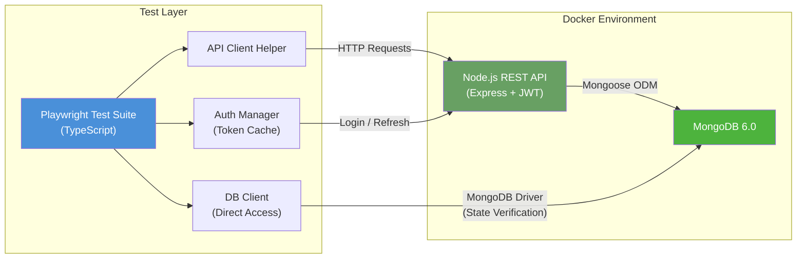

**Key Design Principle:** Tests validate both the API response (HTTP layer) *and* the actual database state (data layer), ensuring end-to-end correctness that goes beyond what the API surface reveals.

---

## 📋 Prerequisites

| Tool              | Version  | Purpose                          |
|-------------------|----------|----------------------------------|
| **Docker**        | 20.10+   | Container runtime for SUT        |
| **Docker Compose**| v2.0+    | Multi-service orchestration      |
| **Node.js**       | 18+      | Test runner environment          |
| **npm**           | 9+       | Dependency management            |

> [!NOTE]
> Docker Desktop (macOS/Windows) or Docker Engine (Linux) includes both Docker and Docker Compose.

---

## 🚀 Quick Start

Get the entire test suite running in **3 commands**:

```bash
# 1. Install test dependencies
npm install

# 2. Build & start the SUT (API + MongoDB) in Docker
npm run docker:up

# 3. Seed the database and run all tests
npm run ci
```

The `ci` script is a composite command that:
1. Starts Docker services (API + MongoDB) with `--build`
2. Waits for services to become healthy and accept requests
3. Seeds the database with baseline data via `npm run test:setup`
4. Executes the full Playwright test suite via `npm test`

---

## 📁 Project Structure

```
casestudy/
├── docker-compose.yml          # Docker services: API + MongoDB
├── Dockerfile.app              # Builds SUT from source (clones repo)
├── package.json                # Scripts, dependencies, metadata
├── playwright.config.ts        # Test runner configuration
├── tsconfig.json               # TypeScript compiler options
├── .env                        # Environment variables (URLs, DB URIs)
│
├── assets/                     # Clean screenshots of test execution reports
│
├── src/
│   ├── helpers/
│   │   ├── api-client.ts       # High-level Tutorial CRUD client
│   │   ├── auth-manager.ts     # JWT token cache & login helpers
│   │   ├── db-client.ts        # Direct MongoDB access for verification
│   │   ├── db-fixture.ts       # Custom Playwright fixture injecting DB clients
│   │   └── test-data.ts        # Centralized test constants & fixtures
│   │
│   ├── setup/
│   │   ├── global-setup.ts     # Pre-test: health check, seed, register users
│   │   ├── global-teardown.ts  # Post-test: disconnect DB, cleanup
│   │   └── seed.ts             # Idempotent database seeding script
│   │
│   └── tests/
│       ├── auth/
│       │   ├── signup.spec.ts          # User registration tests
│       │   ├── signin.spec.ts          # User login & JWT tests
│       │   └── refresh-token.spec.ts   # Token refresh flow tests
│       │
│       ├── rbac/
│       │   └── role-access.spec.ts     # RBAC enforcement tests
│       │
│       ├── security/
│       │   └── security.spec.ts        # Input validation & security tests
│       │
│       ├── tutorials/
│       │   ├── create.spec.ts          # Tutorial creation tests
│       │   ├── read.spec.ts            # Tutorial retrieval tests
│       │   ├── update.spec.ts          # Tutorial updates tests
│       │   └── delete.spec.ts          # Tutorial deletion tests
│       │
│       └── e2e/
│           ├── user-journey.spec.ts          # End-to-end user lifecycle tests
│           └── multi-role-workflow.spec.ts   # End-to-end multi-role collaboration tests
│
└── sut-config/                 # Custom SUT configuration overrides
    ├── server.js               # Express server with CORS + tutorial routes
    ├── db.config.js            # MongoDB connection config (Docker-aware)
    ├── tutorial.model.js       # Mongoose Tutorial schema
    ├── tutorial.controller.js  # CRUD controller logic
    └── tutorial.routes.js      # Route definitions with auth middleware
```

---

## 🐳 Docker Environment Setup (Task 1)

The test environment runs two containerized services orchestrated via Docker Compose:

| Service     | Image           | Port (Internal) | Port (Host) | Description                             |
|-------------|-----------------|-----------------|-------------|-----------------------------------------|
| **app**     | Custom (built)  | 8080            | **8081**    | Node.js REST API (SUT)                  |
| **mongodb** | `mongo:6.0`     | 27017           | **27018**   | MongoDB database with persistent volume |

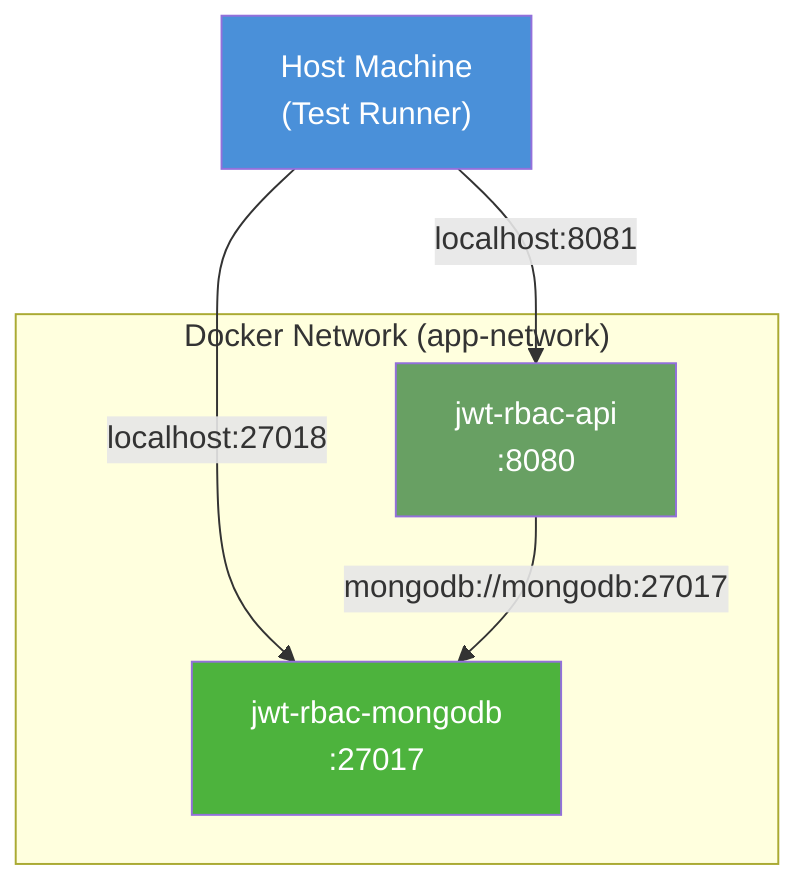

### Isolation & Port Collision Prevention
To prevent conflicts with existing local development databases or services running on default ports, the containers map external host ports uniquely:
- The REST API maps external port `8081` to internal port `8080`.
- MongoDB maps external port `27018` to internal port `27017`.

This guarantees tests run in a fully isolated sandbox without impacting or being impacted by any local service.

---

## 🌱 Idempotent DB Seeding (Task 2)

The database seeding mechanism guarantees a clean, predictable state before any tests run.

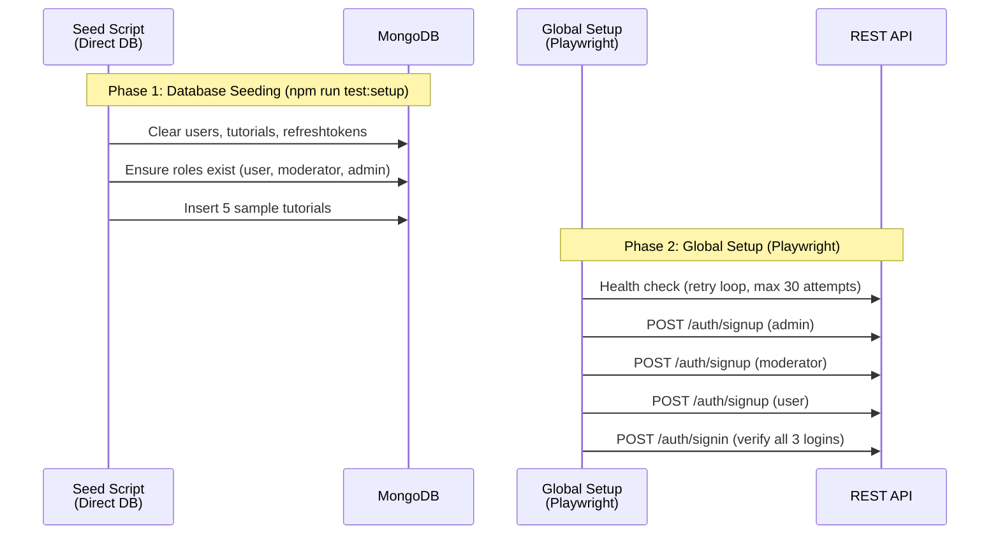

### Deterministic Seed Baseline
The seeding process is divided into two parts:
1. **Direct DB Insertion (`seed.ts`)**: Direct database manipulation bypassing the API layer. It empties the collections and recreates the baseline data.
2. **API-driven Registration (`global-setup.ts`)**: Registers standard test accounts via API request endpoints (`/api/auth/signup`) to verify API compatibility.

### Idempotency Principles
- **Collection Clearing**: Uses `deleteMany({})` to prune old state before writing.
- **Role Safeguards**: Checks for role existence (`countDocuments()`) to prevent duplication.
- **Graceful Registrations**: Catches and handles "username/email already exists" (HTTP 400) responses gracefully to prevent global setup crashes.

---

## 🏗️ Playwright API Testing Architecture

While Playwright is primarily known for browser automation, it is highly suited for API automation via its native `APIRequestContext`. This project uses Playwright's core strengths to implement a production-grade backend integration test architecture:

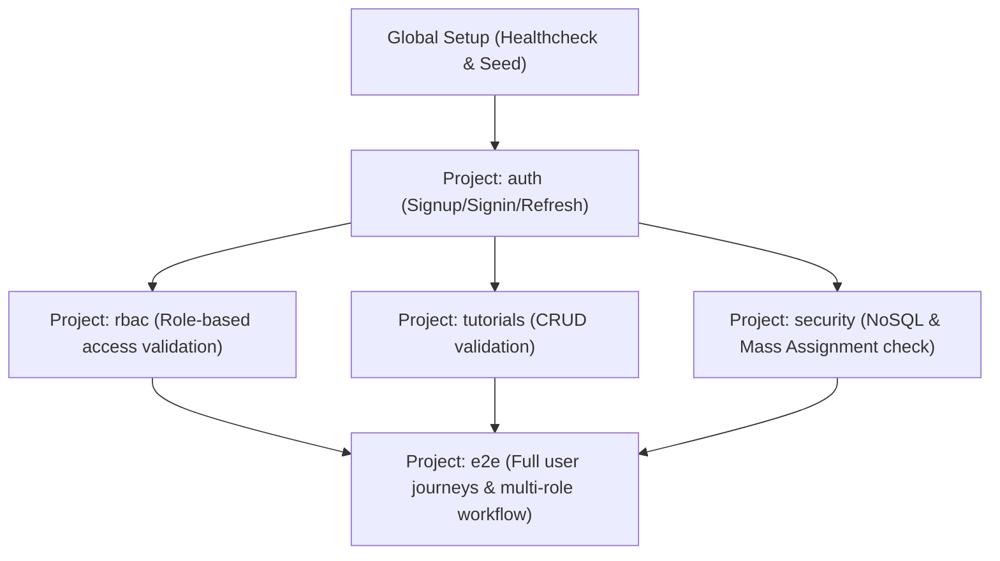

### Key Architectural Strengths

1. **Native Request Contexts**: Bypasses heavy browser processes and leverages Playwright's `APIRequestContext` to execute HTTP requests with low overhead.
2. **Project-based Suite Separation**: Tests are separated into specialized projects (`auth`, `rbac`, `tutorials`, `security`, `e2e`) in [playwright.config.ts](./playwright.config.ts).
3. **Explicit Dependency Trees**: Declared dependencies between test projects ensure that basic functionality tests (like authentication) pass completely before complex, dependent suites (like RBAC or E2E) run. This prevents cascades of misleading test failures.
4. **HTML Report Tracing**: Captures exact request bodies, response payloads, headers, and timings. Failed assertions show exactly where the response diverged from expectations.

---

## 🔌 Custom Database Fixture (Dependency Injection)

A core highlight of the suite's architecture is the custom database fixture defined in [db-fixture.ts](./src/helpers/db-fixture.ts).

### Inversion of Control (IoC) Pattern
Rather than manually writing database connection code (`connectDB` / `disconnectDB`) inside every test file, we extend Playwright's test runner to inject an active database client:

```typescript
import { test as baseTest } from '@playwright/test';
import { Db } from 'mongodb';
import { connectDB, disconnectDB } from './db-client';

type DatabaseFixture = {
  db: Db;
};

export const test = baseTest.extend<DatabaseFixture>({
  db: async ({}, use) => {
    // 1. Establish database connection before the test executes
    const database = await connectDB();

    // 2. Yield control and inject the database client object into the test case
    await use(database);

    // 3. Automatically disconnect after test completes (teardown phase)
    await disconnectDB();
  },
});
```

### Architectural Benefits
- **Zero Boilerplate**: Individual test suites simply destructure `{ db }` directly in their test signature.
- **Resource Management**: Guarantees that MongoDB connections are cleanly closed upon test completion, preventing connection pools from leaking or hanging.
- **State Integrity**: Enables direct database state assertions (e.g. verifying database records exist or are deleted) in sync with HTTP requests.

---

## 🛡️ Security Coverage & Sanitization (DevSecOps)

The automated suite includes a dedicated security testing suite (`src/tests/security/security.spec.ts`) designed to validate the REST API's boundary validation logic.

### 1. NoSQL Injection Validation
Vulnerability testing is performed on authentication endpoints (e.g., `/api/auth/signin`) to ensure user inputs are sanitized and do not evaluate MongoDB query operators.
- **Test Vector**: Submitting query operators like `{ "$gt": "" }` in the username field.
- **Assertion**: Verifies that the API rejects the request (typically returning a `401 Unauthorized` or `404 Not Found` depending on CastError handling) and does not perform internal query execution.
- **Identified Defect (BUG-003)**: During security profiling, we discovered that sending a nested query object (e.g. `{ "$ne": null }`) in the `password` field triggers a crash inside the SUT's `bcryptjs` execution. This critical Denial of Service (DoS) bug is documented in detail in our [Bug Report](./docs/BUG_REPORT.md).

### 2. Mass Assignment Protection
Validates that incoming payloads cannot inject arbitrary fields directly into database documents (protecting privilege escalation paths).
- **Test Vector**: Submitting user signup payloads containing extra properties like `unauthorizedField: 'superadmin_access_payload_hack'`.
- **Verification**: Registers the user, then uses the direct MongoDB database fixture to fetch the raw database document and assert that `unauthorizedField` does not exist on the saved model.

---

## 🔄 Deterministic Testing Guarantees

To ensure tests produce repeatable results on every execution, we enforce three deterministic pillars:

1. **Seeded DB State**:
   - The test setup uses `seed.ts` to restore a pristine MongoDB baseline.
   - For state-sensitive tests (like tutorial reads), tests run `beforeAll(seed(false))` which resets the collections to their baseline state without clearing or recreating user credentials, maintaining fast execution times.
2. **Isolated Execution**:
   - Playwright runs separate test files in separate worker environments.
   - Database operations are structured so that concurrent workers write or delete document IDs that are unique (e.g., utilizing dynamic UUID prefixes or cleanups), preventing data collisions.
3. **Reproducible Environment**:
   - Docker Compose locks the versions of our SUT runtime (Node.js 18) and DB engine (MongoDB 6.0).
   - Local environments and CI environments are guaranteed to execute identical code under identical container constraints.

---

## ⚙️ Continuous Integration (CI/CD Workflow)

The repository includes a complete GitHub Actions integration pipeline defined in [.github/workflows/ci.yml](./.github/workflows/ci.yml).

### Pipeline Execution Flow

```
┌────────────────────────┐
│      GitHub Event      │ (Push / Pull Request / Nightly Schedule)
└───────────┬────────────┘
            ▼
┌────────────────────────┐
│     Checkout Code      │
└───────────┬────────────┘
            ▼
┌────────────────────────┐
│   Setup Node & Cache   │ (Node.js 18.x with npm caching)
└───────────┬────────────┘
            ▼
┌────────────────────────┐
│   tsc --noEmit Check   │ (Compile-time TypeScript checks)
└───────────┬────────────┘
            ▼
┌────────────────────────┐
│  Docker Compose Start  │ (Spins up API and MongoDB containers)
└───────────┬────────────┘
            ▼
┌────────────────────────┐
│    API Healthcheck     │ (Attempts connection loop up to 60s)
└───────────┬────────────┘
            ▼
┌────────────────────────┐
│  Seed Database State   │ (Executes npm run test:setup)
└───────────┬────────────┘
            ▼
┌────────────────────────┐
│  Execute Integration   │ (Playwright Test runner execution)
└───────────┬────────────┘
            ▼
┌────────────────────────┐
│  Clean Up Containers   │ (docker compose down -v)
└───────────┬────────────┘
            ▼
┌────────────────────────┐
│ Upload Test Artifacts  │ (Uploads HTML report and test-results)
└────────────────────────┘
```

The pipeline runs completely headlessly. On failures, Playwright's detailed traces and HTML reports are uploaded as build artifacts, retaining trace records for 14 days.

---

## ▶️ Test Execution & Commands

### Run the Full Pipeline

To replicate the CI/CD pipeline locally:
```bash
npm run ci
```

### Run Specific Test Categories

```bash
# Run Authentication tests only
npm run test:auth

# Run Role-Based Access Control tests only
npm run test:rbac

# Run Tutorial CRUD tests only
npm run test:tutorials

# Run Security-specific validation tests only
npm run test:security

# Run End-to-End user journeys
npm run test:e2e
```

### Interactive Test Execution

To view test reports or run in headed modes:
```bash
# Open Playwright HTML Report Dashboard
npm run test:report

# Run tests in headed browser mode
npm run test:headed
```

---

## 📊 Visual Test Reports & Screenshots

Below are screenshots from our Playwright HTML report showing the test execution breakdown, categories, and validation results.

### 🖥️ 1. Test Suite Execution Overview
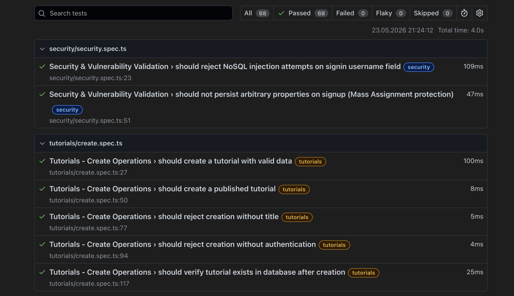
*Figure 1: High-level dashboard showing test categories, durations, and environment configurations.*

### ✅ 2. Comprehensive Test Run Passing
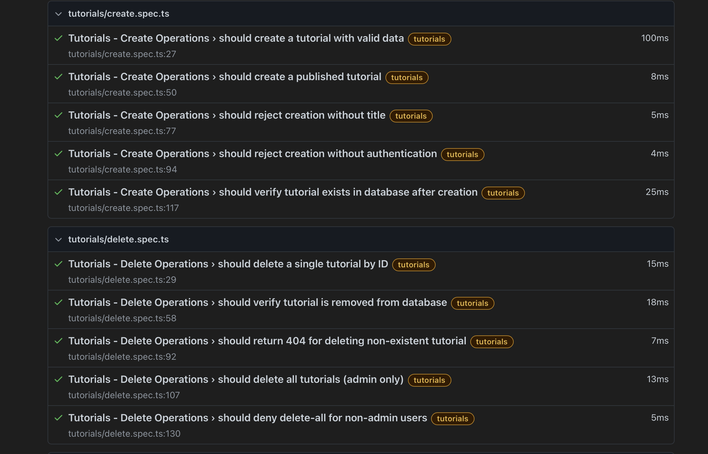
*Figure 2: Checklist showing all test cases successfully executing and passing.*

### 🔑 3. Authentication Test Suite
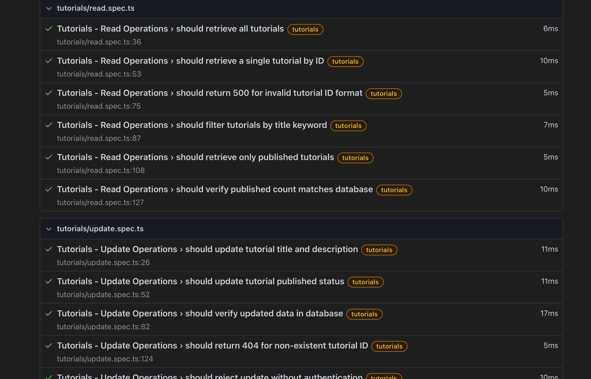
*Figure 3: Signup, signin, and token refresh validation results.*

### 🛡️ 4. Role-Based Access Control (RBAC) Suite
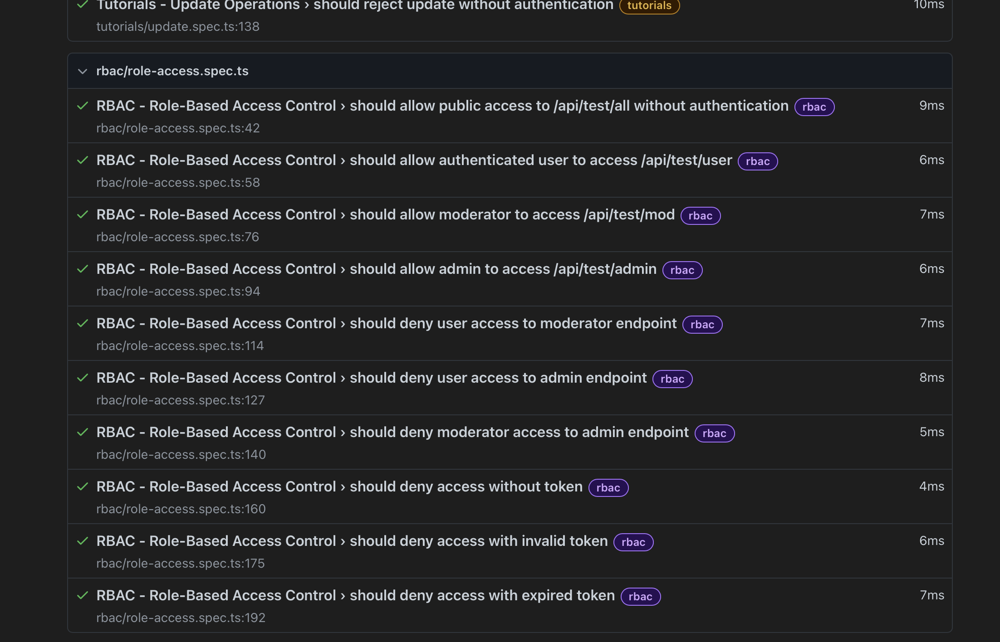
*Figure 4: Validation of access permissions across different security roles.*

### 📝 5. Tutorial CRUD Operations Suite
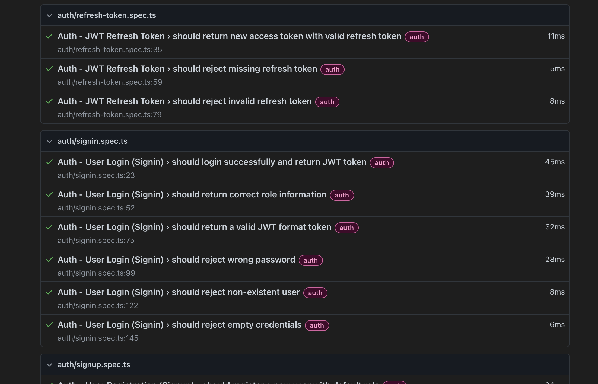
*Figure 5: CRUD behavior validation on Tutorial documents.*

### 🔒 6. Security Validation Suite
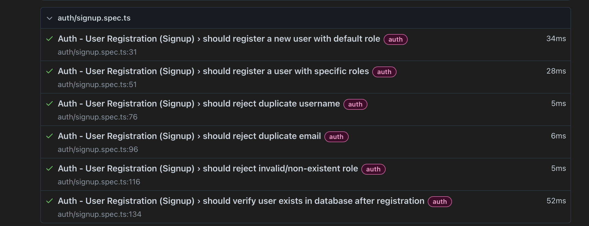
*Figure 6: Automated verification of NoSQL injection rejection and mass assignment blocks.*

### 🔄 7. End-to-End Journeys Suite
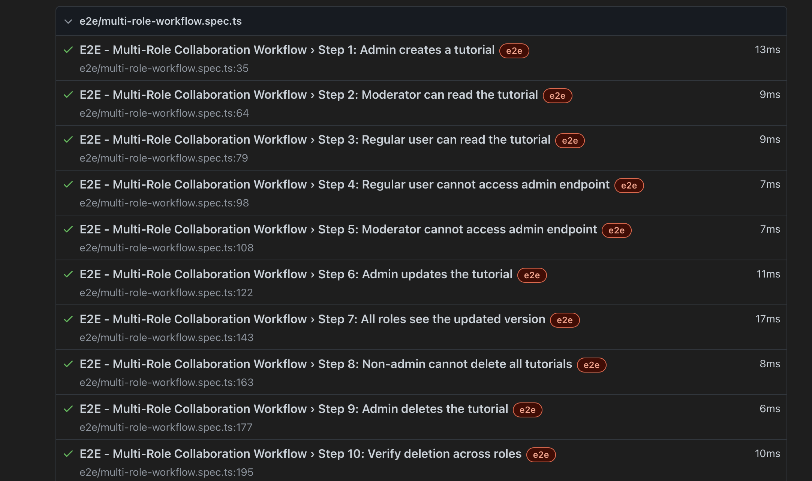
*Figure 7: Complete E2E user lifecycle and multi-role collaboration flows.*

### 🔍 8. Detailed Step Execution Trace
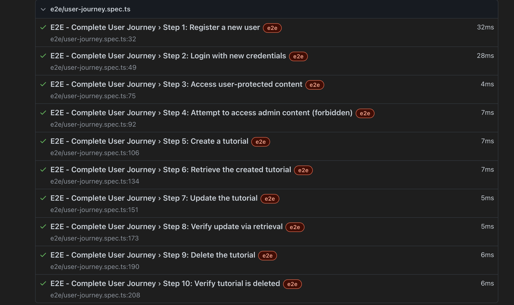
*Figure 8: Playwright trace view highlighting individual HTTP status codes and database assertion steps.*

---

## 🔧 Tool Selection & Justification

| Criterion               | Playwright Test          | Jest + Supertest        | Mocha + Chai            |
|-------------------------|--------------------------|-------------------------|-------------------------|
| **API Testing**         | Built-in `request`       | Requires Supertest      | Requires chai-http      |
| **TypeScript**          | First-class              | Via ts-jest             | Via ts-mocha            |
| **Parallel Execution**  | Worker-based isolation   | `--runInBand` default   | Manual setup            |
| **Project Dependencies**| ✅ Native                | ❌ Not supported        | ❌ Not supported        |
| **HTML Reporter**       | ✅ Built-in              | Via jest-html-reporter  | Via mochawesome         |
| **Global Setup/Teardown**| ✅ First-class           | ✅ Supported            | ✅ Via root hooks       |
| **Trace/Debug**         | ✅ Built-in traces       | Manual                  | Manual                  |
| **Learning Curve**      | Low (for API)            | Low                     | Moderate                |

> [!TIP]
> For a full comparison of architecture trade-offs, read our [TOOL_SELECTION.md](./docs/TOOL_SELECTION.md) document.

---

## 📚 QA Deliverables & Documentation

This test suite is supported by extensive documentation detailing architectural decisions, SUT defects, and project reflections:

- **[Bug Report](./docs/BUG_REPORT.md)**: Standardized logging of SUT defects discovered during test execution (including high-severity issues like BUG-003).
- **[Reflection](./docs/REFLECTION.md)**: Analysis of trade-offs, architectural decisions, and production-level system improvements.
- **[Tool Selection](./docs/TOOL_SELECTION.md)**: Deep-dive justification for choosing Playwright Test and direct MongoDB driver interfaces.

---

## 👤 Author

**Berkay Karataş**

---

## 📄 License

This project is licensed under the MIT License.
